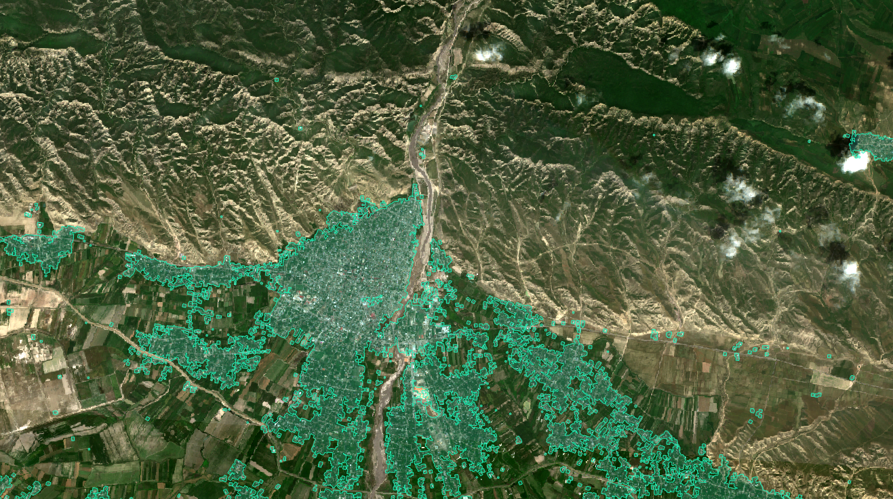

# HIECTOR: HIErarchical object deteCTOR 

 The aim of this tool is to apply object detection on satellite imagery of varying spatial resolutions in a hierarchical fashion. The prototype developed uses Sentinel-2, Airbus SPOT and Airbus Pleiades as data sources for a hierarchical detection at three spatial scales. While the tool can be used for the detection of different man-made objects, we validated HIECTOR on building detection.

The core idea is to execute the detection of built-up areas using Sentinel-2 imagery first, to define areas where SPOT imagery would be requested. At the second level of the pyramid, the detection is executed on SPOT imagery to determine large-to-medium sized buildings, and areas of low confidence where small and dense buildings are located. On those areas, Pleiades imagery would be requested and object detection performed to delineate the smallest buildings.  

The hierarchical approach is based on the assumption that the majority of man-made objects of interest, e.g. buildings, bridges, airplanes, are very sparse in nature and applying object detection on Very High Resolution at large-scale is inefficient and very costly.

To facilitate the generalization and application of the task at different scales we formulate the task as the detection of oriented objects, with the direct estimation of oriented bounding boxes (OBB). We built on the [_Single-Stage Rotation-Decoupled Detector for Oriented Object_](https://github.com/Capino512/pytorch-rotation-decoupled-detector) (SSRDD) architecture and used a pretrained ResNet34 backbone to train a model on Sentinel-2 imagery and a joint model on Pleiades/SPOT imagery. The models take as input 4-channels images, namely the blue, green, red and infrared bands.

The models were trained and evaluated on a national scale in a middle-eastern country. Quantitative evaluation of HIECTOR on a large scale allowed to characterise the cost-saving benefits of the approach with respect to the detection accuracy. These models were fine-tuned on a small set of manually created labels in Dakar, Senegal and openly distributed [here](http://queryplanet.sentinel-hub.com/index.html). Along with the fine-tuned models, you can also download the manually created building footprints. Check-out the [hiector example repository]((https://github.com/sentinel-hub/eo-learn-examples/tree/main/hiector)) which shows how to run inference on Dakar, Senegal.

Pre-trained models and a small set (e.g. ~8k) of manually labelled building footprints are open-source and available on the AWS S3 bucket [queryplanet.sentinel-hub.com](http://queryplanet.sentinel-hub.com/index.html). 

The models are released under [CC BY-NC 4.0](https://creativecommons.org/licenses/by-nc/4.0/) license, while the `hiector` code is available under [MIT](https://opensource.org/licenses/MIT) license.

## Requirements

`Hiector` relies on the Sentinel Hub service, which allows access to data over any specific AOI and time interval. Moreover, Sentinel Hub allows you to programmatically and seamlessly order and access various commercial satellite imagery. The hierarchical drill-down approach is made possible by the *_"access and pay only for what you need"_* feature of the service. Free trial accounts are available, which you can get [here](https://services.sentinel-hub.com/oauth/subscription). 

As the tool is designed for large-scale processing, it uses [Amazon Web Services](https://aws.amazon.com/) to store the data and parallelise the processing over multiple instances. However, the inference notebook available in the [example](https://github.com/sentinel-hub/eo-learn-examples/tree/main/hiector) can be run locally using either CPU or GPU acceleration.

## Installation

You can install `hiector` by cloning the repository and running the following command from within the repo:

```bash
pip install .
```

For development, you can install it in an editable mode with additional development dependencies:

```bash
pip install -e .[DEV]
```

### Compile Non-Max Suppression code

The SSRDD model uses a fast implementation of the NMS algorithm which needs to be compiled depending on the available hardware (e.g. GPU or CPU).

To compile the code run the following bash snippet.

```bash
# for GPU and Linux only:
cd hiector/ssrdd/utils/box/ext/rbbox_overlap_gpu
python setup.py build_ext --inplace

# alternative for CPU and either Windows or Linux:
cd hiector/ssrdd/utils/box/ext/rbbox_overlap_cpu
python setup.py build_ext --inplace
```

To verify whether your installation has been successful, run the tests (after installing development requirements as `pip install -r requirements-dev.txt`).

## Training and inference

The code herein provided allows to train, run inference and evaluate SSRDD object detection models on satellite imagery of different resolutions. In this section we describe how to proceed if you wanted to train SSRDD models or if you wanted to use them for inference.

### Training

The code assumes the data sources at different resolutions and the corresponding building footprints are stored as `EOPatches`. Please refer to the `eo-learn-io` examples and the `hiector` inference notebook for code snippets on how to achieve this. There are two main ways to download Sentinel-2 imagery through Sentinel Hub, namely the [Process API](https://docs.sentinel-hub.com/api/latest/api/process/) and the [Batch Processing API](https://docs.sentinel-hub.com/api/latest/api/batch/). The latter is faster and cheaper compared to the former, but is available to enterprise users only. Get in touch if you want to gain access to it. 

Once the `EOPatches` with images and labels have been download and stored on an AWS S3 bucket, the following operations are executed:

 * prepare the training data, by splitting the images into smaller image chips of specific sizes, e.g. 128, 256 and 512, along with corresponding labels. These images will be resampled to a given size, e.g. 256 to achieve multi-scale learning. The minimum rotated bounding boxes containing the building footprint is used as reference OBB. The pairs of image chips and labels are stored in a separate folder on a bucket, and will be loaded in parallel during training. The `scripts/preparetraining_data.py` script performs this operation, and additionally saves on bucket a GeoPackage file storing geometries and metadata of all the generated image chips and labels;
 * split the image-label pairs into _train_, _validation_ and _test_ sets. Splitting is done at the `EOPatch` level, ensuring data from the same `EOPatch` ends up in the same split. This process adds a column to the metadata GeoDataframe created above, and allows for cross-validation of the created models. This operation is performed by the `scripts/training_data_selection.py`
 * compute normalisation factors using the `scripts/compute_normalization_stats.py`. Random image chips are sampled to compute statistics on the band values distribution. Such statistics are used to normalise the input images;
 * model training using the `scripts/ssrdd/execute.py` script. Query filters on the metadata provide the flexibility to run experiments using different data, for instance based on the number of OBBs in the sample or percentage of no data. Multiple data sources can be used in training a single model, as was done for Airbus Pleiades and SPOT imagery. The trained model is both saved locally and on the AWS S3 bucket, allowing to run inference on multiple parallel instances.

All the above-mentioned scripts can be run specifying an input config file, facilitating the automation of execution. An example config file is provided in `configs/dakar-example/` folder. The configuration file shows how the pre-processing, training and inference on Pleiades imagery for Dakar was executed.

### Inference

`Hiector` allows you to run inference in two separate ways:

 * on the training data consisting of image chip and label pairs, using the `execute.py` script. This inference uses the metadata file to create the dataset, so you can use filters, such as selecting the _test_ subset only. You can choose to run this inference on GPU or CPU;
 * directly on the `EOPatches` on multiple parallel processes/instances using `ray` and the `scripts/ssrdd/raypredict.py` script. This option is designed to run inference on large AOIs, allowing to scale inference on multiple CPU processes and instances. `eo-learn` and `ray` automatically handle scaling of the inference workflow to multiple AWS spot instances. In order to run this inference, you can build the provided `docker` image providing the required credentials, and update the `infrastructure/cluster.yaml` file with the docker image ID and AMI. Running `ray up infrastructure/cluster.yaml` should then set up the head of a cluster of spot instances, and `ray exec infrastructure/cluster.yaml --start --tmux "python packages/hiector/scripts/ssrdd/raypredict.py --config /home/ray/packages/hiector/configs/dakar-example/config_pleiades_and_spot_k7_eval_pleiades_dakar.json --on-the-fly"`. The snippet below shows you how to build the Docker image from the provided Docker file.
```bash
docker build --no-cache -f=Dockerfile
        --build-arg S3_AWS_ACCESS_KEY=${S3_AWS_ACCESS_KEY}
        --build-arg S3_AWS_SECRET_KEY=${S3_AWS_SECRET_KEY}
        --build-arg SH_INSTANCE_ID=${SH_INSTANCE_ID}
        --build-arg SH_CLIENT_ID=${SH_CLIENT_ID}
        --build-arg SH_CLIENT_SECRET=${SH_CLIENT_SECRET}
        --build-arg SENTINELHUB_BRANCH=${SENTINELHUB_BRANCH}
        --build-arg EOLEARN_BRANCH=${EOLEARN_BRANCH}
        --build-arg HIECTOR_BRANCH=${HIECTOR_BRANCH}
```

Once inference with either of the methods listed above is completed, several text files storing the estimated OBBs in the [DOTA](https://captain-whu.github.io/DOTA/) format are created. The following step is to convert these predictions into polygons and merge the predictions together into a single GeoDataframe, resolving potential overlaps between predictions. This is achieved with the `scripts/ssrdd/dota_to_gpkg.py`.

If reference labels are available, mean Average Precision (mAP) scores can be computed executing the `scripts/compute_ap.py` script.

All the above steps can be executed from CLI providing the configuration example file available in `configs/dakar-example`.

Check-out the inference notebook in `eo-learn-examples` for an end-to-end example of how to run inference using three data sources and apply the hierarchical detection in a fast and cost-efficient way for large areas-of-interest.

## Blog posts

[HIECTOR: Hierarchical object detector at scale](https://medium.com/sentinel-hub/hiector-hierarchical-object-detector-at-scale-5a61753b51a3) describes the entire procedure in more detail, along with validation results.

Below you can find some prediction examples using Sentinel-2, Airbus SPOT and Airbus Pleiades imagery. Overlapping predictions for Sentinel-2 have been merged into single polygons.

| Sentinel-2 | Airbus SPOT | Airbus Pleiades |
|:-----------|:------------|:----------------|
|  |  |  |
|  |  |  |
|  |  |  |
|  |  |  |
|  |  |  |

## Acknowledgements

Project funded by [ESA](https://www.esa.int/About_Us/ESRIN) [Philab](https://philab.phi.esa.int/) through the QueryPlanet 4000124792/18/I-BG grant.

## Questions

If you have any comment or question please get in touch at _eoresearch@sinergise.com_.
